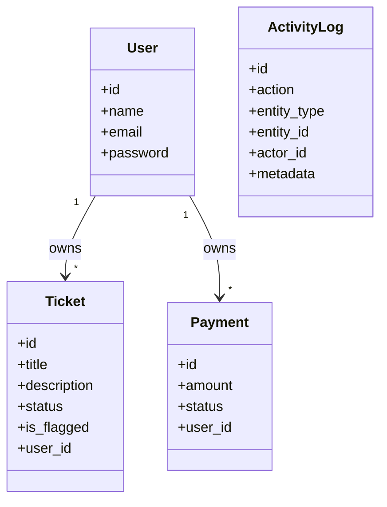
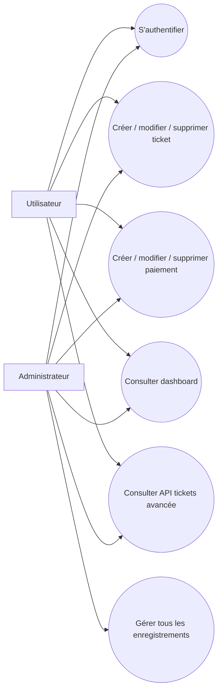
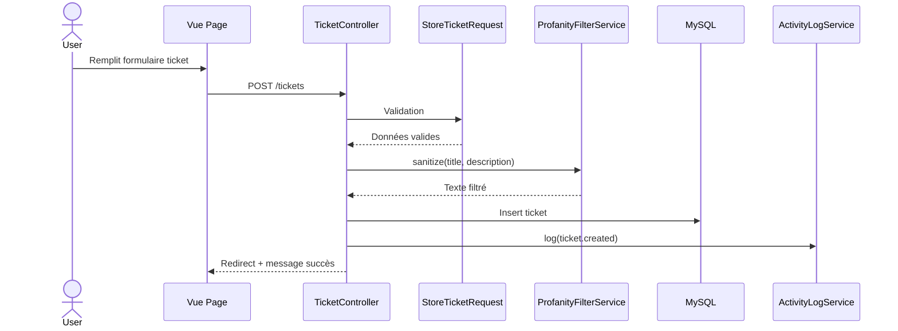

# UML

## 1. Diagramme de classes (Mermaid)

```mermaid
classDiagram
    class User {
      +id
      +name
      +email
      +password
    }

    class Ticket {
      +id
      +title
      +description
      +status
      +is_flagged
      +user_id
    }

    class Payment {
      +id
      +amount
      +status
      +user_id
    }

    class ActivityLog {
      +id
      +action
      +entity_type
      +entity_id
      +actor_id
      +metadata
    }

    User "1" --> "*" Ticket : owns
    User "1" --> "*" Payment : owns
```

## 2. Cas d'utilisation (Mermaid)

```mermaid
flowchart LR
    U[Utilisateur]
    A[Administrateur]

    UC1((S'authentifier))
    UC2((Créer / modifier / supprimer ticket))
    UC3((Créer / modifier / supprimer paiement))
    UC4((Consulter dashboard))
    UC5((Consulter API tickets avancée))
    UC6((Gérer tous les enregistrements))

    U --> UC1
    U --> UC2
    U --> UC3
    U --> UC4
    U --> UC5

    A --> UC1
    A --> UC2
    A --> UC3
    A --> UC4
    A --> UC5
    A --> UC6
```

## 3. Séquence simple - création de ticket

```mermaid
sequenceDiagram
    actor User
    participant Vue as Vue Page
    participant Ctrl as TicketController
    participant Req as StoreTicketRequest
    participant Filter as ProfanityFilterService
    participant SQL as MySQL
    participant Mongo as ActivityLogService

    User->>Vue: Remplit formulaire ticket
    Vue->>Ctrl: POST /tickets
    Ctrl->>Req: Validation
    Req-->>Ctrl: Données valides
    Ctrl->>Filter: sanitize(title, description)
    Filter-->>Ctrl: Texte filtré
    Ctrl->>SQL: Insert ticket
    Ctrl->>Mongo: log(ticket.created)
    Ctrl-->>Vue: Redirect + message succès
```
